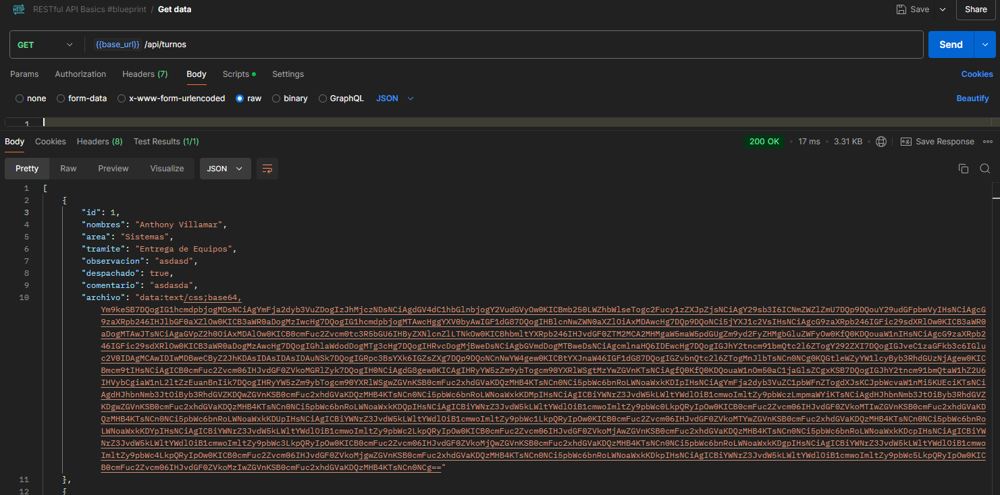
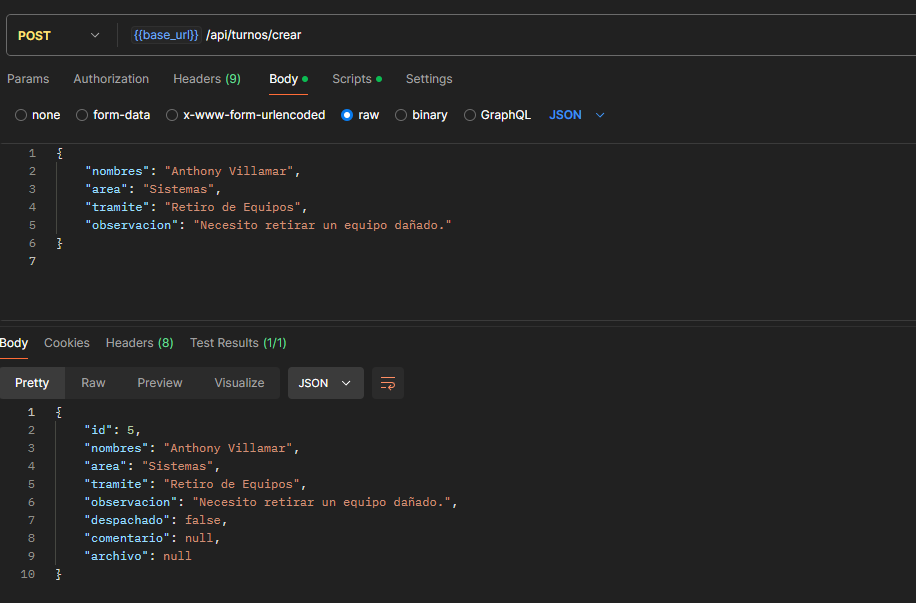
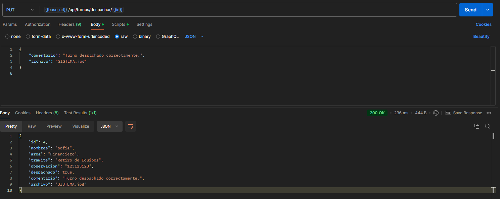
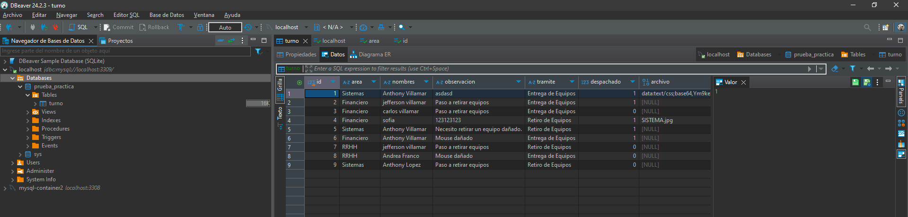

# Proyecto Backend - Gestión de Turnos

## Descripción
El backend proporciona la lógica y las API necesarias para la gestión de turnos. Permite:
- Crear nuevos turnos.
- Consultar turnos disponibles.
- Marcar turnos como despachados para inactivar y ocultar de futuras consultas.

## Requisitos
- Java 17 o superior
- Maven
- Docker (para la base de datos MySQL)
- Git

## Instalación
1. Clona el repositorio:
```bash
git clone <URL_DEL_REPOSITOR_GITLAB>
cd nombre-del-repositorio
```

2. Comando para instalar dependencias usando Maven:
```bash
mvn clean install
```

## Configuración
Configura las variables de entorno para conectar el backend a la base de datos MySQL.

Crea un archivo de configuración `application.yml` en `src/main/resources/` con el siguiente contenido:

```yaml
spring:
  datasource:
    url: jdbc:mysql://localhost:3306/nombre_base_datos
    username: usuario
    password: contraseña
  jpa:
    hibernate:
      ddl-auto: update
    properties:
      hibernate.dialect: org.hibernate.dialect.MySQLDialect
server:
  port: 8080
```

Para iniciar una base de datos MySQL en Docker, usa el comando:
```bash
docker run --name mysql-turnos -e MYSQL_ROOT_PASSWORD=root -e MYSQL_DATABASE=nombre_base_datos -e MYSQL_USER=usuario -e MYSQL_PASSWORD=contraseña -p 3306:3306 -d mysql:8.0
```

## Ejecución
Inicia el backend usando Maven:
```bash
mvn spring-boot:run
```
Accede al servidor en http://localhost:8080.

## Endpoints
1. Metodo GET | /api/turnos - Obtiene todos los turnos



2. Metodo POST | /api/turnos/crear - Crea un nuevo turno



3. Metodo Put | /api/turnos/despachar/{id} - Marca el turno como despachado.


* Datos guardados en la base


## Tecnologías

- Java 21: Lenguaje de programación.
- Spring Boot 3.3.5: Framework para la construcción de aplicaciones Java.
- MySQL: Base de datos relacional, gestionada con Docker.
- Maven: Herramienta de gestión de dependencias y construcción.
- Docker: Para configurar la base de datos MySQL como un contenedor.
